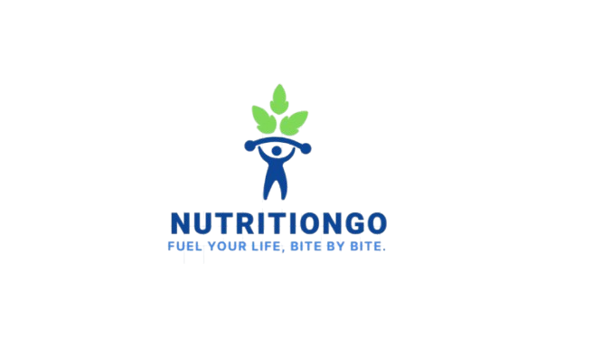

<a id="readme-top"></a>
<!-- PROJECT SHIELDS -->
[![Contributors][contributors-shield]](https://github.com/DhiaGhouma)
[![LinkedIn][linkedin-shield]](https://www.linkedin.com/in/dhia-ghouma-725ab4212/)

<!-- SHIELD LINKS -->
[contributors-shield]: https://img.shields.io/badge/Contributors-1-orange
[linkedin-shield]: https://img.shields.io/badge/LinkedIn-Profile-blue?logo=linkedin&logoColor=white


<!-- PROJECT LOGO -->
<br />
<div align="center">
  <a href="https://github.com/ayari-khalil/nutrition-semantic">

  </a>

  <h3 align="center">Nutrition AI Semantic Web Application</h3>

  <p align="center">
    An intelligent nutrition and wellness recommendation system powered by AI, OWL ontologies, and SPARQL queries!
    <br />
    <a href="https://github.com/ayari-khalil/nutrition-semantic"><strong>Explore the docs »</strong></a>
    <br />
    <br />
    <a href="https://github.com/ayari-khalil/nutrition-semantic">View Demo</a>
    ·
    <a href="https://github.com/ayari-khalil/nutrition-semantic/issues">Report Bug</a>
    ·
    <a href="https://github.com/ayari-khalil/nutrition-semantic/issues">Request Feature</a>
  </p>
</div>

<!-- TABLE OF CONTENTS -->
<details>
  <summary>Table of Contents</summary>
  <ol>
    <li>
      <a href="#about-the-project">About The Project</a>
      <ul>
        <li><a href="#built-with">Built With</a></li>
        <li><a href="#key-features">Key Features</a></li>
      </ul>
    </li>
    <li>
      <a href="#getting-started">Getting Started</a>
      <ul>
        <li><a href="#prerequisites">Prerequisites</a></li>
        <li><a href="#installation">Installation</a></li>
      </ul>
    </li>
    <li><a href="#usage">Usage</a></li>
    <li><a href="#architecture">Architecture</a></li>
    <li><a href="#api-documentation">API Documentation</a></li>
    <li><a href="#roadmap">Roadmap</a></li>
    <li><a href="#contributing">Contributing</a></li>
    <li><a href="#license">License</a></li>
    <li><a href="#contact">Contact</a></li>
    <li><a href="#acknowledgments">Acknowledgments</a></li>
  </ol>
</details>

<!-- ABOUT THE PROJECT -->
## About The Project

**Nutrition AI Semantic Web Application** is an innovative system that combines artificial intelligence with semantic web technologies to provide personalized nutrition recommendations. The application uses natural language processing to convert user questions into SPARQL queries, executing them against an OWL ontology to deliver intelligent, context-aware nutrition insights.

### Why This Project?

* **Natural Language Interface**: Ask questions in plain language - no need to learn SPARQL or complex query syntax
* **Semantic Intelligence**: Leverages OWL ontologies for rich, interconnected nutrition data
* **AI-Powered**: Uses Groq's LLM (Llama 3.3) to understand and translate natural language queries
* **Real-Time Results**: Instant query execution with Apache Jena Fuseki SPARQL server
* **Beautiful UI**: Modern, responsive interface built with React and Tailwind CSS

<p align="right">(<a href="#readme-top">back to top</a>)</p>

### Built With

This project leverages modern technologies across the full stack:

**Frontend:**
* [![React][React.js]][React-url]
* [![TailwindCSS][Tailwind.css]][Tailwind-url]
* [![Axios][Axios]][Axios-url]

**Backend:**
* [![Python][Python]][Python-url]
* [![Flask][Flask]][Flask-url]
* [![RDFLib][RDFLib]][RDFLib-url]

**AI & Semantic Web:**
* [![Groq][Groq]][Groq-url]
* [![Apache Jena][Jena]][Jena-url]
* [![OWL][OWL]][OWL-url]

<p align="right">(<a href="#readme-top">back to top</a>)</p>

### Key Features

- 🤖 **AI-Powered NLP**: Converts natural language to SPARQL queries using Groq LLM
- 🔍 **Semantic Search**: Query nutrition data using rich ontological relationships
- 📊 **Real-Time Results**: Instant query execution and beautiful result visualization
- 🎨 **Modern UI**: Glass-morphism design with smooth animations
- 🌐 **RESTful API**: Well-documented API endpoints for integration
- 📱 **Responsive Design**: Works seamlessly on desktop, tablet, and mobile
- 🔒 **Type-Safe**: Python type hints and proper error handling
- ⚡ **Fast Performance**: Optimized SPARQL queries and efficient data processing

<p align="right">(<a href="#readme-top">back to top</a>)</p>

<!-- GETTING STARTED -->
## Getting Started

Follow these steps to get your local copy up and running.

### Prerequisites

Before you begin, ensure you have the following installed:

* **Python 3.8+**
  ```sh
  python --version
  ```

* **Node.js 14+**
  ```sh
  node --version
  npm --version
  ```

* **Java 8+** (for Apache Jena Fuseki)
  ```sh
  java -version
  ```

### Installation

#### 1. Clone the repository
```sh
git clone https://github.com/ayari-khalil/nutrition-semantic.git
cd nutrition-semantic
```

#### 2. Set up Apache Jena Fuseki

1. Download [Apache Jena Fuseki](https://jena.apache.org/download/)
2. Extract the archive
3. Start Fuseki:
   ```sh
   cd apache-jena-fuseki-x.x.x
   ./fuseki-server        # Linux/Mac
   fuseki-server.bat      # Windows
   ```
4. Access Fuseki UI at `http://localhost:3030`
5. Create a dataset named `nutrition`
6. Upload the ontology file: `ontology/ontologie.owx`

#### 3. Set up Backend (Python)

```sh
cd backend

# Create virtual environment
python -m venv venv

# Activate virtual environment
source venv/bin/activate        # Linux/Mac
venv\Scripts\activate           # Windows

# Install dependencies
pip install -r requirements.txt

# Configure environment variables
cp .env.example .env
# Edit .env and add your Groq API key
```

**Get a free Groq API Key:**
1. Visit [https://console.groq.com/](https://console.groq.com/)
2. Sign up for a free account
3. Navigate to API Keys
4. Create a new key
5. Add to `backend/.env`:
   ```env
   GROQ_API_KEY=gsk_your_api_key_here
   FUSEKI_URL=http://localhost:3030/nutrition/sparql
   ```

#### 4. Set up Frontend (React)

```sh
cd frontend

# Install dependencies
npm install

# Install additional packages
npm install react-icons axios
```

#### 5. Start the application

**Terminal 1 - Backend:**
```sh
cd backend
source venv/bin/activate    # or venv\Scripts\activate on Windows
python app.py
```

**Terminal 2 - Frontend:**
```sh
cd frontend
npm start
```

The application will open at `http://localhost:3000` 🎉

<p align="right">(<a href="#readme-top">back to top</a>)</p>

<!-- USAGE EXAMPLES -->
## Usage

### Example Queries

Try these natural language questions:

1. **User Information**
   ```
   Quels sont tous les utilisateurs?
   Quel est le poids de Dhia?
   Quel est l'âge de Khalil?
   ```

2. **Allergies & Preferences**
   ```
   Quelles sont les allergies de Khalil?
   Quelles sont les préférences de Dhia?
   ```

3. **Nutrition Data**
   ```
   Quels aliments contiennent des protéines?
   Quels sont les nutriments de la pomme?
   ```

4. **Health Goals**
   ```
   Quels utilisateurs ont un objectif de perte de poids?
   ```

5. **Physical Activities**
   ```
   Quelles activités physiques pratique moetaz?
   ```

### API Usage

**Natural Language Query:**
```bash
curl -X POST http://localhost:5000/query \
  -H "Content-Type: application/json" \
  -d '{"question": "Quels sont tous les utilisateurs?"}'
```

**Direct SPARQL Query:**
```bash
curl -X POST http://localhost:5000/sparql \
  -H "Content-Type: application/json" \
  -d '{
    "query": "PREFIX : <http://www.semanticweb.org/gigabytei5/ontologies/2025/9/untitled-ontology-5#> SELECT ?user WHERE { ?user a :Utilisateur . }"
  }'
```

**Response Format:**
```json
{
  "success": true,
  "question": "Quels sont tous les utilisateurs?",
  "sparql": "PREFIX : <...> SELECT ?user WHERE { ?user a :Utilisateur . }",
  "results": [
    {"user": "Dhia"},
    {"user": "Khalil"},
    {"user": "moetaz"},
    {"user": "yosr"}
  ],
  "count": 4
}
```

_For more examples, please refer to the [API Documentation](https://github.com/ayari-khalil/nutrition-semantic/wiki)_

<p align="right">(<a href="#readme-top">back to top</a>)</p>

<!-- ARCHITECTURE -->
## Architecture

```
┌─────────────┐      ┌──────────────┐      ┌─────────────┐
│   React     │─────▶│  Flask API   │─────▶│   Fuseki    │
│  Frontend   │◀─────│   (Python)   │◀─────│   Server    │
└─────────────┘      └──────────────┘      └─────────────┘
                            │
                            ▼
                     ┌──────────────┐
                     │   Groq LLM   │
                     │ (NLP → SPARQL)│
                     └──────────────┘
```

**Component Breakdown:**

1. **Frontend (React)**: User interface for querying and displaying results
2. **Backend (Flask)**: RESTful API that coordinates between components
3. **NLP Module**: Converts natural language to SPARQL using Groq's LLM
4. **Fuseki Server**: SPARQL endpoint hosting the OWL ontology
5. **Ontology**: OWL/RDF knowledge base with nutrition data

<p align="right">(<a href="#readme-top">back to top</a>)</p>

<!-- API DOCUMENTATION -->
## API Documentation

### Endpoints

#### `GET /health`
Health check endpoint.

**Response:**
```json
{
  "status": "ok",
  "message": "API is running"
}
```

#### `POST /query`
Convert natural language to SPARQL and execute.

**Request:**
```json
{
  "question": "Quels sont tous les utilisateurs?"
}
```

**Response:**
```json
{
  "success": true,
  "question": "Quels sont tous les utilisateurs?",
  "sparql": "PREFIX : <...> SELECT ?user WHERE { ?user a :Utilisateur . }",
  "results": [...],
  "count": 4
}
```

#### `POST /sparql`
Execute a direct SPARQL query.

**Request:**
```json
{
  "query": "PREFIX : <...> SELECT ?user WHERE { ?user a :Utilisateur . }"
}
```

**Response:**
```json
{
  "success": true,
  "results": [...],
  "count": 4
}
```

<p align="right">(<a href="#readme-top">back to top</a>)</p>

<!-- ROADMAP -->
## Roadmap

- [x] Basic NLP to SPARQL conversion
- [x] React frontend with modern UI
- [x] Integration with Groq LLM
- [x] Apache Jena Fuseki integration
- [ ] User authentication and profiles
- [ ] Personalized meal planning
- [ ] Recipe recommendations
- [ ] Multi-language support
    - [ ] English
    - [ ] Arabic
- [ ] Mobile app (React Native)
- [ ] Advanced analytics dashboard
- [ ] Export results to PDF/CSV
- [ ] Voice input support

See the [open issues](https://github.com/ayari-khalil/nutrition-semantic/issues) for a full list of proposed features (and known issues).

<p align="right">(<a href="#readme-top">back to top</a>)</p>

<!-- CONTRIBUTING -->
## Contributing

Contributions are what make the open source community such an amazing place to learn, inspire, and create. Any contributions you make are **greatly appreciated**.

If you have a suggestion that would make this better, please fork the repo and create a pull request. You can also simply open an issue with the tag "enhancement".
Don't forget to give the project a star! Thanks again!

1. Fork the Project
2. Create your Feature Branch (`git checkout -b feature/AmazingFeature`)
3. Commit your Changes (`git commit -m 'Add some AmazingFeature'`)
4. Push to the Branch (`git push origin feature/AmazingFeature`)
5. Open a Pull Request

<p align="right">(<a href="#readme-top">back to top</a>)</p>

<!-- LICENSE -->
## License

Distributed under the MIT License. See `LICENSE.txt` for more information.

<p align="right">(<a href="#readme-top">back to top</a>)</p>

<!-- CONTACT -->
## Contact

Dhia Ghouma - [LinkedIn](https://www.linkedin.com/in/dhia-ghouma-725ab4212/) - ghoumadhia01@gmail.com

Project Link: [https://github.com/ayari-khalil/nutrition-semantic](https://github.com/ayari-khalil/nutrition-semantic)

<p align="right">(<a href="#readme-top">back to top</a>)</p>

<!-- ACKNOWLEDGMENTS -->
## Acknowledgments

Resources and tools that made this project possible:

* [Groq](https://groq.com/) - Lightning-fast LLM inference
* [Apache Jena](https://jena.apache.org/) - Semantic web framework
* [Protégé](https://protege.stanford.edu/) - Ontology editor
* [React Icons](https://react-icons.github.io/react-icons/)
* [Tailwind CSS](https://tailwindcss.com/)
* [Flask Documentation](https://flask.palletsprojects.com/)
* [RDFLib Documentation](https://rdflib.readthedocs.io/)
* [SPARQL 1.1 Query Language](https://www.w3.org/TR/sparql11-query/)
* [Best README Template](https://github.com/othneildrew/Best-README-Template)

<p align="right">(<a href="#readme-top">back to top</a>)</p>

<!-- MARKDOWN LINKS & IMAGES -->
[contributors-shield]: https://img.shields.io/github/contributors/ayari-khalil/nutrition-semantic.svg?style=for-the-badge
[contributors-url]: https://github.com/ayari-khalil/nutrition-semantic/graphs/contributors
[forks-shield]: https://img.shields.io/github/forks/ayari-khalil/nutrition-semantic.svg?style=for-the-badge
[forks-url]: https://github.com/ayari-khalil/nutrition-semantic/network/members
[stars-shield]: https://img.shields.io/github/stars/ayari-khalil/nutrition-semantic.svg?style=for-the-badge
[stars-url]: https://github.com/ayari-khalil/nutrition-semantic/stargazers
[issues-shield]: https://img.shields.io/github/issues/ayari-khalil/nutrition-semantic.svg?style=for-the-badge
[issues-url]: https://github.com/ayari-khalil/nutrition-semantic/issues
[license-shield]: https://img.shields.io/github/license/ayari-khalil/nutrition-semantic.svg?style=for-the-badge
[license-url]: https://github.com/ayari-khalil/nutrition-semantic/blob/master/LICENSE.txt
[linkedin-shield]: https://img.shields.io/badge/-LinkedIn-black.svg?style=for-the-badge&logo=linkedin&colorB=555
[linkedin-url]: https://www.linkedin.com/in/dhia-ghouma-725ab4212/

[React.js]: https://img.shields.io/badge/React-20232A?style=for-the-badge&logo=react&logoColor=61DAFB
[React-url]: https://reactjs.org/
[Python]: https://img.shields.io/badge/Python-3776AB?style=for-the-badge&logo=python&logoColor=white
[Python-url]: https://www.python.org/
[Flask]: https://img.shields.io/badge/Flask-000000?style=for-the-badge&logo=flask&logoColor=white
[Flask-url]: https://flask.palletsprojects.com/
[Tailwind.css]: https://img.shields.io/badge/Tailwind_CSS-38B2AC?style=for-the-badge&logo=tailwind-css&logoColor=white
[Tailwind-url]: https://tailwindcss.com/
[Axios]: https://img.shields.io/badge/Axios-5A29E4?style=for-the-badge&logo=axios&logoColor=white
[Axios-url]: https://axios-http.com/
[RDFLib]: https://img.shields.io/badge/RDFLib-darkgreen?style=for-the-badge
[RDFLib-url]: https://rdflib.readthedocs.io/
[Groq]: https://img.shields.io/badge/Groq-000000?style=for-the-badge&logo=groq&logoColor=white
[Groq-url]: https://groq.com/
[Jena]: https://img.shields.io/badge/Apache_Jena-D22128?style=for-the-badge&logo=apache&logoColor=white
[Jena-url]: https://jena.apache.org/
[OWL]: https://img.shields.io/badge/OWL-orange?style=for-the-badge
[OWL-url]: https://www.w3.org/OWL/